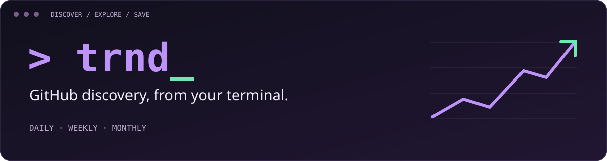

<p align="center">
  
</p>

<p align="center">
  <a href="https://github.com/jamshids/trnd/actions/workflows/ci.yml"></a>
  <a href="LICENSE"></a>
  
</p>

<p align="center">
  <strong>Find what's trending. Explore a repository. Save what catches your eye.</strong><br>
  A keyboard-driven GitHub explorer in a single binary, with no runtime dependencies.
</p>

<p align="center">
  <a href="#install">Install</a> ·
  <a href="#quick-start">Quick start</a> ·
  <a href="examples/README.md">Examples &amp; screenshots</a> ·
  <a href="#interactive-keys">Keyboard shortcuts</a> ·
  <a href="https://github.com/jamshids/trnd/releases">Downloads</a>
</p>

---


<p align="center"><sub>Today's repositories, star growth, and languages — all at a glance.</sub></p>

## Built for a quick look that becomes a deep dive

| Discover | Explore | Keep |
| --- | --- | --- |
| Browse daily, weekly, or monthly trends. | Read READMEs without leaving your terminal. | Bookmark repositories locally for later. |
| Filter by language and topic; sort by growth. | Open a repository or copy its clone URL. | Star on GitHub or export results as JSON. |

<details>
<summary><strong>See topic filtering and bookmarks</strong></summary>

### Find tools in your language


### Save your next read


[Explore the examples →](examples/README.md)

</details>

## Quick start

```sh
trnd                         # open the interactive explorer
trnd -l go -s weekly          # this week's trending Go repositories
trnd -l go --topic cli        # find Go command-line tools
trnd list -n 10               # print the top 10
trnd list --json              # export for scripts
```

Move with `↑`/`↓` or `j`/`k`, press `enter` to open, `b` to bookmark, and `?` for help.

[More command examples and screenshots →](examples/README.md)

## Install

### Windows

Download the Windows ZIP for your architecture (`amd64` for x64, `arm64` for ARM64) from [Releases](https://github.com/jamshids/trnd/releases). Extract it, then open PowerShell in that folder:

```powershell
.\trnd.exe
.\trnd.exe list -n 10
```

Add the extracted folder to your PATH to run `trnd` from anywhere. Go is not needed for the downloaded executable.

### Linux / macOS

```sh
curl -sSfL https://raw.githubusercontent.com/jamshids/trnd/main/install.sh | sh
```

### Install with Go

```sh
go install github.com/jamshids/trnd@latest
```
By default, this installs into `~/go/bin` (`%USERPROFILE%\go\bin` on Windows). If `trnd` isn't found afterwards, add that
folder to your PATH, e.g. `fish_add_path ~/go/bin` in fish or
`export PATH="$HOME/go/bin:$PATH"` in bash/zsh.

**Other downloads:** `.deb`, `.rpm`, `.apk` and Windows `.zip` files are attached to each [release](https://github.com/jamshids/trnd/releases).

## Interactive keys

| Key | Action |
|---|---|
| `↑`/`↓` or `j`/`k` | move |
| `enter` / `o` | open repo in browser |
| `r` | read the README in the terminal |
| `c` | copy clone URL |
| `s` | star the repo on GitHub (needs a token) |
| `b` | save / unsave the repo (bookmark) |
| `B` | show saved repos (`esc` to go back) |
| `tab` | cycle daily → weekly → monthly |
| `l` | change language |
| `t` | filter by topics, e.g. `llm, cli` |
| `S` | cycle sort: trending → gained → stars → forks → name |
| `/` | search the list |
| `R` | refresh (skip cache) |
| `?` | all keys |
| `q` | quit |

## Flags

| Flag | Description |
|---|---|
| `-l, --lang` | language, e.g. `go`, `java`, `python` |
| `-s, --since` | `daily` (default), `weekly`, `monthly` |
| `--spoken` | spoken language of the repo, e.g. `en`, `zh` |
| `-t, --topic` | only repos with any of these topics, e.g. `llm,cli` |
| `--sort` | `trending` (default), `gained`, `stars`, `forks`, `name` |
| `--no-cache` | always fetch fresh data |
| `list -n, --limit` | max repos to print (default 25) |
| `list --json` | JSON output |

## Bookmarks

```sh
trnd saved                               # list saved repos (newest first)
trnd saved --sort stars --json           # sorted, as JSON
trnd saved add charmbracelet/bubbletea   # save any repo, not just trending ones
trnd saved rm charmbracelet/bubbletea
```

Bookmarks are stored in `~/.local/share/trnd/bookmarks.json` on Linux
(respects `XDG_DATA_HOME`) and in the user config directory on macOS/Windows.

Shell completions: `trnd completion bash|zsh|fish|powershell`.

## How it works

GitHub has no trending API, so `trnd` reads the public
[github.com/trending](https://github.com/trending) page. If that page can't be
parsed, it falls back to the official Search API. The fallback shows the
most-starred repos created in the time range, and says so on screen.

**Topics** aren't on the trending page, so with a topic filter `trnd` looks
each repo up via the GitHub API. Topics are cached for 7 days, so repeat
filters are instant. Without a token GitHub allows 60 lookups an hour, so
set one if you filter by topic a lot. Daily trending lists are short (~25
repos); use `-s weekly` or `-s monthly` for more matches.

Results are cached for 15 minutes in your user cache directory
(`~/.cache/trnd` on Linux).

**GitHub token (optional).** A token is read from `GITHUB_TOKEN` or `GH_TOKEN`,
or from the `gh` CLI if you are logged in. It's only needed to star repos
and for higher API rate limits (topic lookups, READMEs).

**Colors.** Light or dark mode is detected from your terminal. Override with
`TRND_THEME=light` or `TRND_THEME=dark`.

## Development

Use the Go version specified in `go.mod` or newer.

**Windows / PowerShell:**

```powershell
go vet ./...
go test ./...
go build -o bin/trnd.exe .
.\bin\trnd.exe
```

**Linux / macOS:**

```sh
make build     # ./bin/trnd
make install   # copy to ~/.local/bin (or PREFIX=/usr/local)
make test
make snapshot  # cross-compile release artifacts into dist/ without publishing
```

To validate release packaging with GoReleaser:

```sh
go run github.com/goreleaser/goreleaser/v2@latest check
go run github.com/goreleaser/goreleaser/v2@latest release --snapshot --clean
```

After committing your changes and passing CI, create an unused version tag:

```sh
git tag -a v0.1.0 -m "First public release"
git push origin v0.1.0
```

Pushing the tag triggers GitHub Actions to publish binaries, Linux packages, and checksums. Use the next version for subsequent releases.

---

<p align="center">Built with Go and the Charm terminal libraries. Distributed under the <a href="LICENSE">MIT license</a>.</p>
