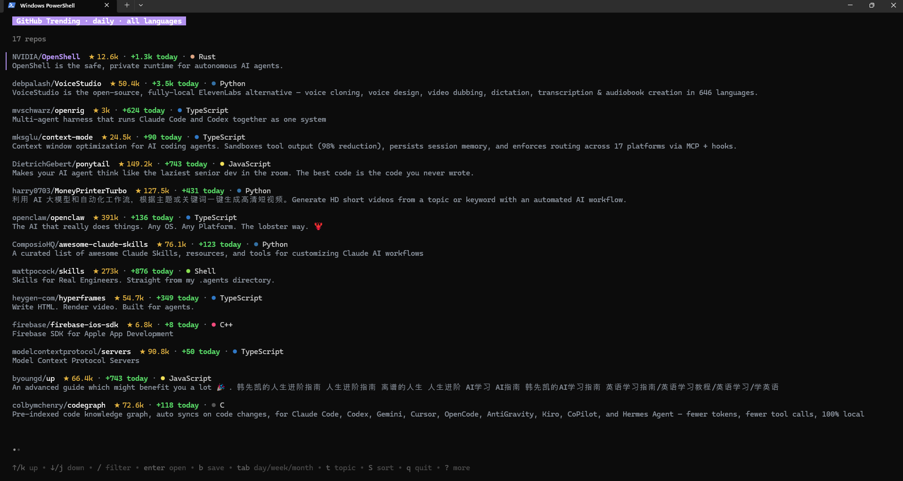
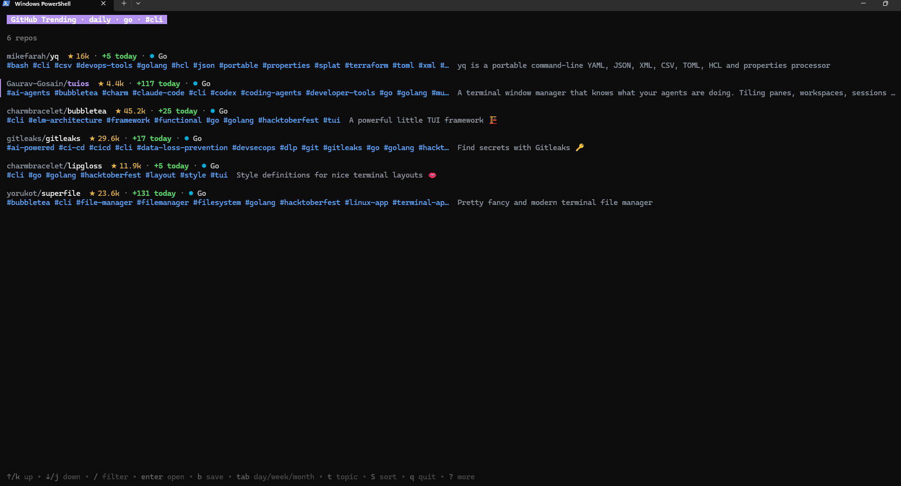
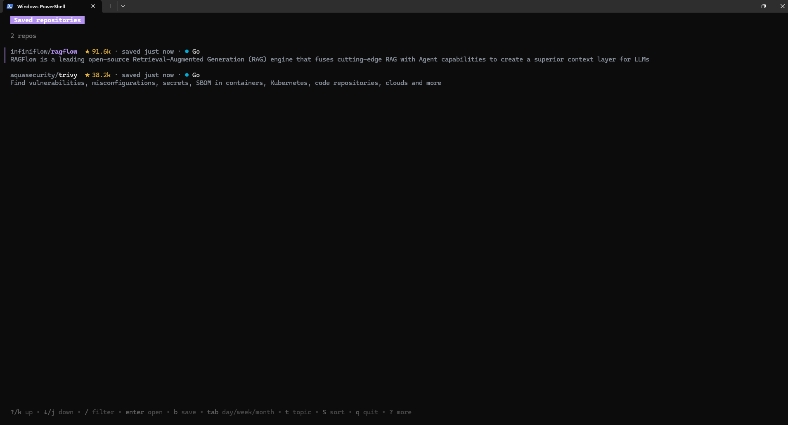

# trnd in action

[← Back to the main README](../README.md)

Real screenshots from Windows Terminal. Repository lists and star counts reflect the time of capture.

## Explore trending repositories

Browse today's repositories across all languages. Press `tab` to switch between daily, weekly, and monthly trends.

```sh
trnd
trnd -l go -s weekly
```



## Find your next CLI tool

Combine a language with a topic. Press `t` in the interface to edit topics, or `/` to search the loaded list.

```sh
trnd -l go --topic cli
trnd list --topic llm,cli
trnd list --sort gained
```



## Keep a reading list

Press `b` to save a repository and `B` to view your bookmarks in the interface. Bookmarks are local; starring on GitHub is a separate action.

```sh
trnd saved
trnd saved add charmbracelet/bubbletea
trnd saved --sort stars --json
trnd saved rm charmbracelet/bubbletea
```



## Use trnd in scripts

```sh
trnd list -n 10
trnd list -l rust -s weekly
trnd list --json
```

With [jq](https://jqlang.org/) installed, extract repository URLs:

```sh
trnd list --json | jq -r '.[].url'
```

On Windows, use `trnd.exe` when it is on your PATH, or `./trnd.exe` from the extracted download folder.

## Screenshot files

The original screenshots live in [`screenshots/`](screenshots/), with descriptive filenames so documentation can link to them directly.
